# Mermaid Diagram Gallery

One or more examples of each Mermaid diagram type, for comparing renderers by eye:

```bash
mdread mermaid.md                     # beautiful-mermaid, Pele for the types it lacks (default)
mdread --mermaid pele mermaid.md      # Pele for every diagram
mdread --mermaid mermaid mermaid.md   # mermaid.js
```

The first sections are the types beautiful-mermaid draws (flowchart, sequence, class, state, ER, XY chart); with the default renderer, Pele draws the rest. Several of those later types are still marked beta in mermaid.js.

## Flowchart: decision tree

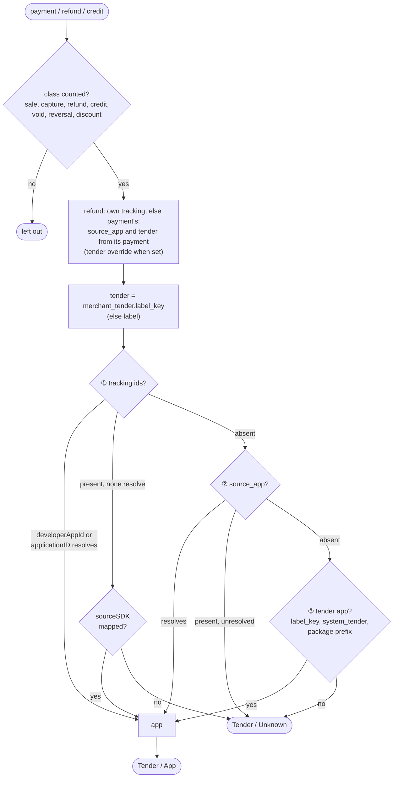
```mermaid
flowchart TD
    tx(["payment / refund / credit"]) --> cls{"class counted?<br/>sale, capture, refund, credit,<br/>void, reversal, discount"}
    cls -->|no| out(["left out"])
    cls -->|yes| inh["refund: own tracking, else payment's;<br/>source_app and tender from its payment<br/>(tender override when set)"]
    inh --> tender["tender = merchant_tender.label_key<br/>(else label)"]
    tender --> t{"① tracking ids?"}
    t -->|"developerAppId or<br/>applicationID resolves"| A["app"]
    t -->|"present, none resolve"| sdk{"sourceSDK<br/>mapped?"}
    sdk -->|yes| A
    sdk -->|no| U
    t -->|absent| s{"② source_app?"}
    s -->|resolves| A
    s -->|"present, unresolved"| U
    s -->|absent| d{"③ tender app?<br/>label_key, system_tender,<br/>package prefix"}
    d -->|yes| A
    d -->|no| U(["Tender / Unknown"])
    A --> R(["Tender / App"])
```

## Flowchart: table relationships

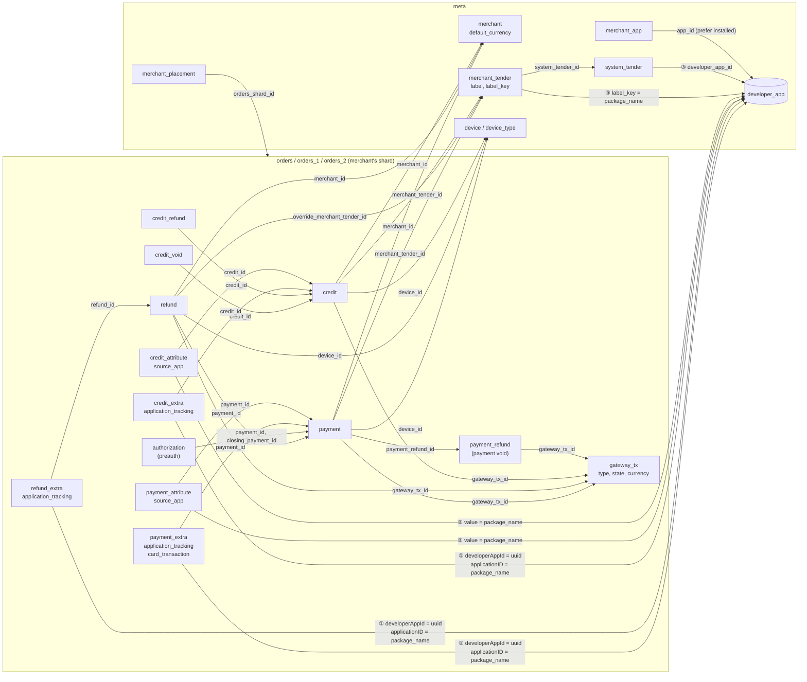
```mermaid
flowchart LR
    subgraph ORDERS["orders / orders_1 / orders_2 (merchant's shard)"]
        payment
        refund
        credit
        pr["payment_refund<br/>(payment void)"]
        auth["authorization<br/>(preauth)"]
        cv["credit_void"]
        cr["credit_refund"]
        pe["payment_extra<br/>application_tracking<br/>card_transaction"]
        re["refund_extra<br/>application_tracking"]
        ce["credit_extra<br/>application_tracking"]
        pa["payment_attribute<br/>source_app"]
        ca["credit_attribute<br/>source_app"]
        gtx["gateway_tx<br/>type, state, currency"]
    end

    subgraph META["meta"]
        mp["merchant_placement"]
        merchant["merchant<br/>default_currency"]
        mt["merchant_tender<br/>label, label_key"]
        st["system_tender"]
        da[("developer_app")]
        ma["merchant_app"]
        dev["device / device_type"]
    end

    mp -->|orders_shard_id| ORDERS
    refund -->|payment_id| payment
    payment -->|payment_refund_id| pr
    auth -->|"payment_id, closing_payment_id"| payment
    cv -->|credit_id| credit
    cr -->|credit_id| credit
    pe -->|payment_id| payment
    re -->|refund_id| refund
    ce -->|credit_id| credit
    pa -->|payment_id| payment
    ca -->|credit_id| credit
    payment & refund & credit & pr -->|gateway_tx_id| gtx

    payment -->|merchant_tender_id| mt
    refund -->|override_merchant_tender_id| mt
    credit -->|merchant_tender_id| mt
    pe & re & ce -->|"① developerAppId = uuid<br/>applicationID = package_name"| da
    pa & ca -->|"② value = package_name"| da
    mt -->|"③ label_key = package_name"| da
    mt -->|system_tender_id| st -->|"③ developer_app_id"| da
    ma -->|"app_id (prefer installed)"| da
    payment & refund & credit -->|device_id| dev
    payment & refund & credit -->|merchant_id| merchant
```

## Flowchart: basics

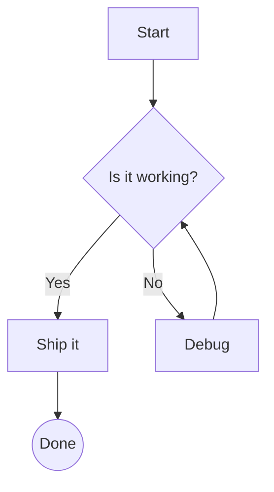
```mermaid
flowchart TD
    %% A comment line, which renderers must ignore
    A[Start] --> B{Is it working?}
    B -->|Yes| C[Ship it]
    B -->|No| D[Debug]
    D --> B
    C --> E((Done))
```

## Flowchart: node shapes and edge types

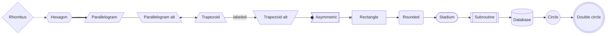
```mermaid
flowchart LR
    rect[Rectangle] --> round(Rounded)
    round --> stadium([Stadium])
    stadium --> sub[[Subroutine]]
    sub --> db[(Database)]
    db --> circle((Circle))
    circle --> dbl(((Double circle)))
    rhombus{Rhombus} -.-> hex{{Hexagon}}
    hex ==> para[/Parallelogram/]
    para --- alt[\Parallelogram alt\]
    alt <--> trap[/Trapezoid\]
    trap -- labeled --> trapalt[\Trapezoid alt/]
    trapalt --o asym>Asymmetric]
    asym --x rect
```

## Flowchart: subgraphs and styling

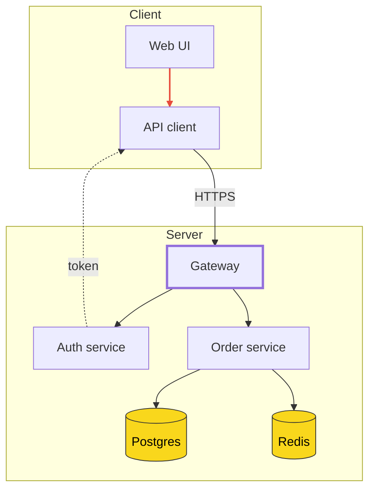
```mermaid
flowchart TB
    subgraph client [Client]
        ui[Web UI] --> sdk[API client]
    end
    subgraph server [Server]
        direction LR
        gateway[Gateway] --> auth[Auth service]
        gateway --> orders[Order service]
        orders --> db[(Postgres)]
        orders --> cache[(Redis)]
    end
    sdk -->|HTTPS| gateway
    auth -. token .-> sdk
    classDef store fill:#f9d71c,stroke:#333,color:#000
    class db,cache store
    style gateway stroke-width:3px
    linkStyle 0 stroke:#e74c3c,stroke-width:2px
```

## Flowchart: label text

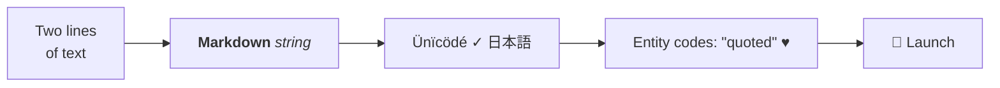
```mermaid
flowchart LR
    multi["Two lines<br/>of text"] --> md["`**Markdown** _string_`"]
    md --> uni["Ünïcödé ✓ 日本語"]
    uni --> ent["Entity codes: #quot;quoted#quot; #9829;"]
    ent --> emoji["🚀 Launch"]
```

## Sequence diagram

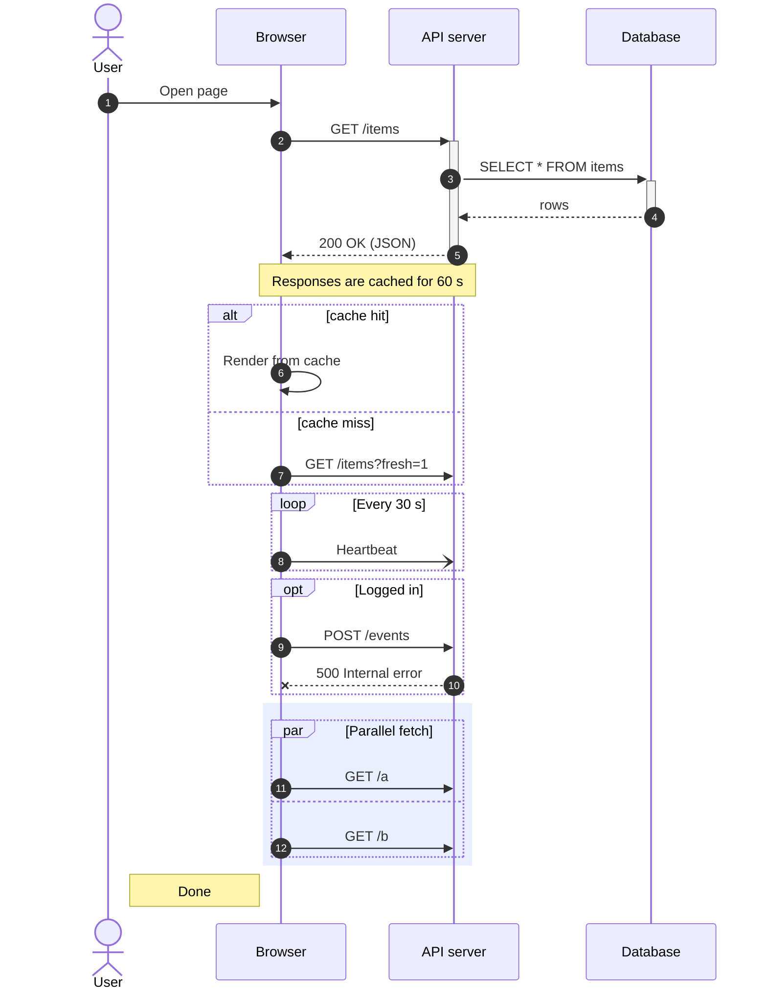
```mermaid
sequenceDiagram
    autonumber
    actor User
    participant Browser
    participant API as API server
    participant DB as Database
    User->>Browser: Open page
    Browser->>+API: GET /items
    API->>+DB: SELECT * FROM items
    DB-->>-API: rows
    API-->>-Browser: 200 OK (JSON)
    Note over Browser,API: Responses are cached for 60 s
    alt cache hit
        Browser->>Browser: Render from cache
    else cache miss
        Browser->>API: GET /items?fresh=1
    end
    loop Every 30 s
        Browser-)API: Heartbeat
    end
    opt Logged in
        Browser->>API: POST /events
        API--xBrowser: 500 Internal error
    end
    rect rgba(100, 150, 255, 0.15)
        par Parallel fetch
            Browser->>API: GET /a
        and
            Browser->>API: GET /b
        end
    end
    Note right of User: Done
```

## Class diagram

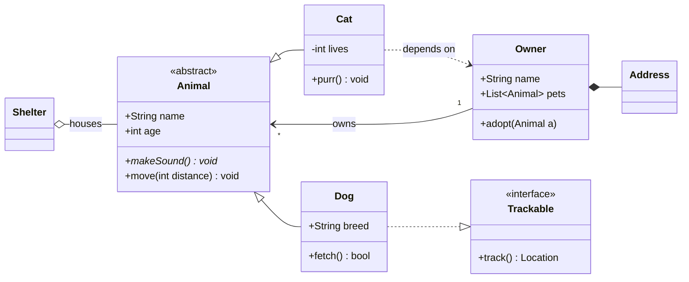
```mermaid
classDiagram
    direction LR
    class Animal {
        <<abstract>>
        +String name
        +int age
        +makeSound()* void
        +move(int distance) void
    }
    class Dog {
        +String breed
        +fetch() bool
    }
    class Cat {
        -int lives
        +purr() void
    }
    class Owner {
        +String name
        +List~Animal~ pets
        +adopt(Animal a)
    }
    class Trackable {
        <<interface>>
        +track() Location
    }
    Animal <|-- Dog
    Animal <|-- Cat
    Owner "1" --> "*" Animal : owns
    Shelter o-- Animal : houses
    Dog ..|> Trackable
    Owner *-- Address
    Cat ..> Owner : depends on
```

## State diagram: composite states and notes

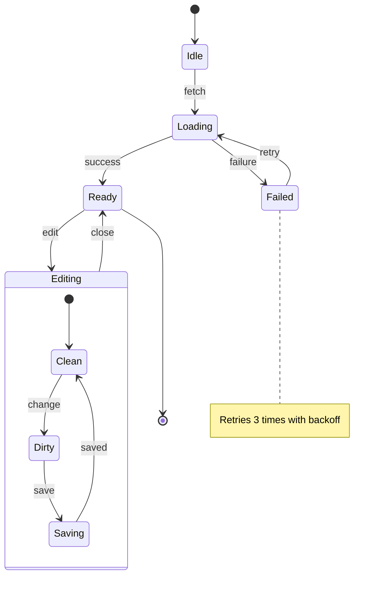
```mermaid
stateDiagram-v2
    [*] --> Idle
    Idle --> Loading : fetch
    Loading --> Ready : success
    Loading --> Failed : failure
    Failed --> Loading : retry
    Ready --> Editing : edit
    state Editing {
        [*] --> Clean
        Clean --> Dirty : change
        Dirty --> Saving : save
        Saving --> Clean : saved
    }
    Editing --> Ready : close
    Ready --> [*]
    note right of Failed : Retries 3 times with backoff
```

## State diagram: choice, fork and join

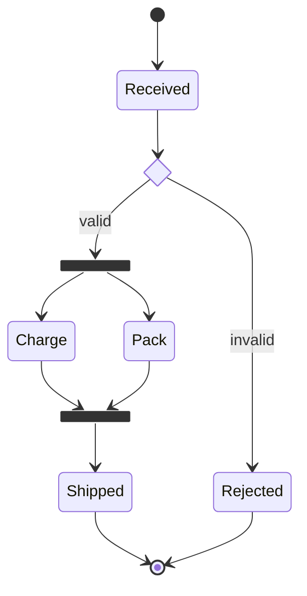
```mermaid
stateDiagram-v2
    state check <<choice>>
    state fork_state <<fork>>
    state join_state <<join>>
    [*] --> Received
    Received --> check
    check --> Rejected : invalid
    check --> fork_state : valid
    fork_state --> Charge
    fork_state --> Pack
    Charge --> join_state
    Pack --> join_state
    join_state --> Shipped
    Shipped --> [*]
    Rejected --> [*]
```

## Entity relationship diagram

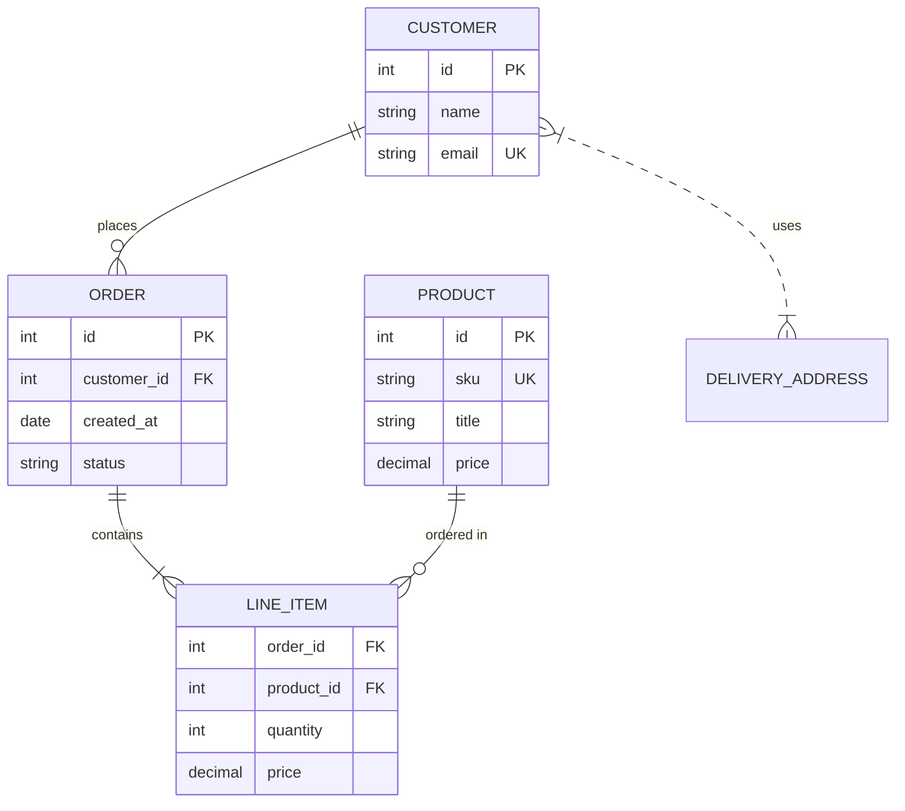
```mermaid
erDiagram
    CUSTOMER ||--o{ ORDER : places
    ORDER ||--|{ LINE_ITEM : contains
    PRODUCT ||--o{ LINE_ITEM : "ordered in"
    CUSTOMER }|..|{ DELIVERY_ADDRESS : uses
    CUSTOMER {
        int id PK
        string name
        string email UK
    }
    ORDER {
        int id PK
        int customer_id FK
        date created_at
        string status
    }
    LINE_ITEM {
        int order_id FK
        int product_id FK
        int quantity
        decimal price
    }
    PRODUCT {
        int id PK
        string sku UK
        string title
        decimal price
    }
```

## XY chart

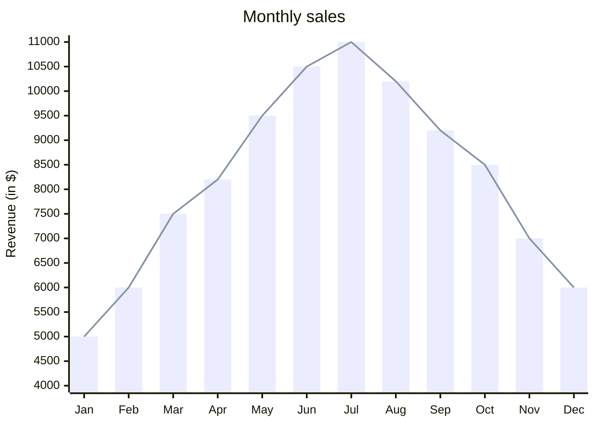
```mermaid
xychart-beta
    title "Monthly sales"
    x-axis [Jan, Feb, Mar, Apr, May, Jun, Jul, Aug, Sep, Oct, Nov, Dec]
    y-axis "Revenue (in $)" 4000 --> 11000
    bar [5000, 6000, 7500, 8200, 9500, 10500, 11000, 10200, 9200, 8500, 7000, 6000]
    line [5000, 6000, 7500, 8200, 9500, 10500, 11000, 10200, 9200, 8500, 7000, 6000]
```

## Pie chart

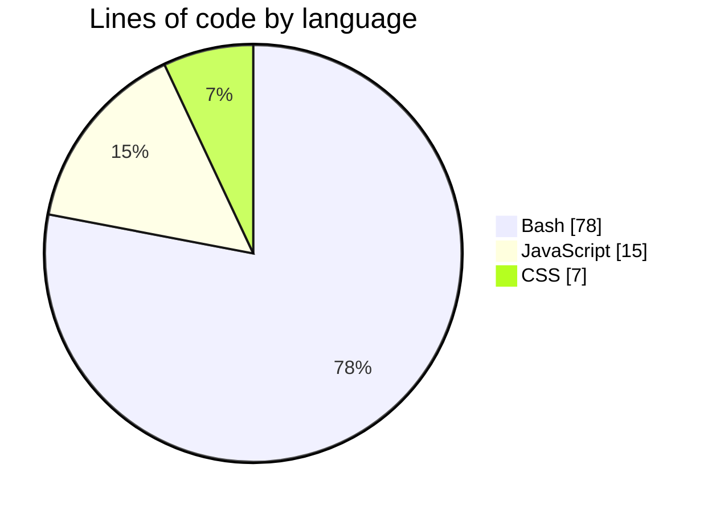
```mermaid
pie showData
    title Lines of code by language
    "Bash" : 78
    "JavaScript" : 15
    "CSS" : 7
```

## Gantt chart

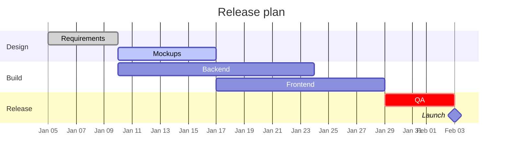
```mermaid
gantt
    title Release plan
    dateFormat YYYY-MM-DD
    axisFormat %b %d
    section Design
        Requirements :done, req, 2026-01-05, 5d
        Mockups      :active, mock, after req, 7d
    section Build
        Backend      :be, after req, 14d
        Frontend     :fe, after mock, 12d
    section Release
        QA           :crit, qa, after be fe, 5d
        Launch       :milestone, launch, after qa, 0d
```

## User journey

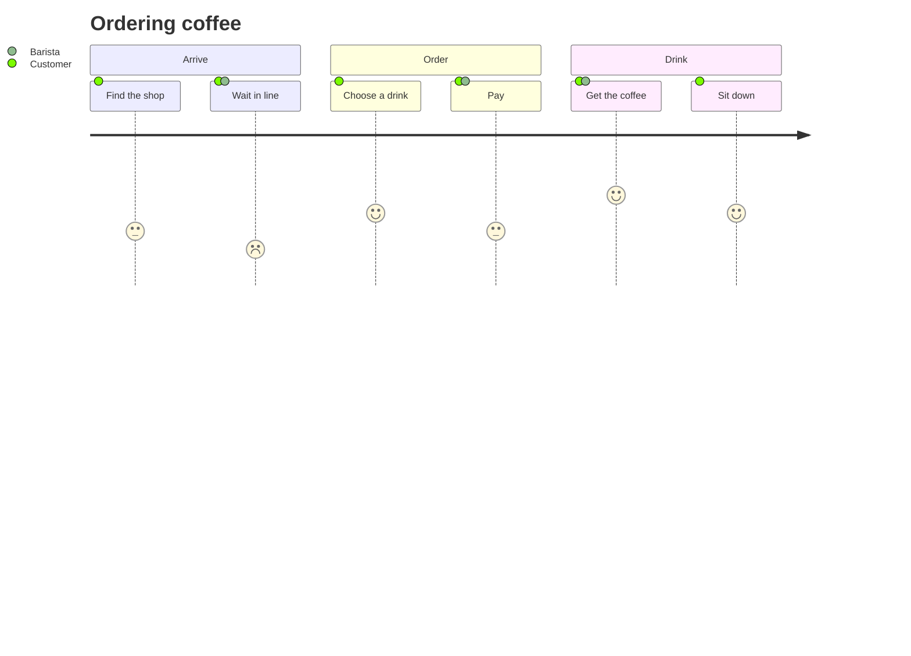
```mermaid
journey
    title Ordering coffee
    section Arrive
        Find the shop: 3: Customer
        Wait in line: 2: Customer, Barista
    section Order
        Choose a drink: 4: Customer
        Pay: 3: Customer, Barista
    section Drink
        Get the coffee: 5: Customer, Barista
        Sit down: 4: Customer
```

## Git graph

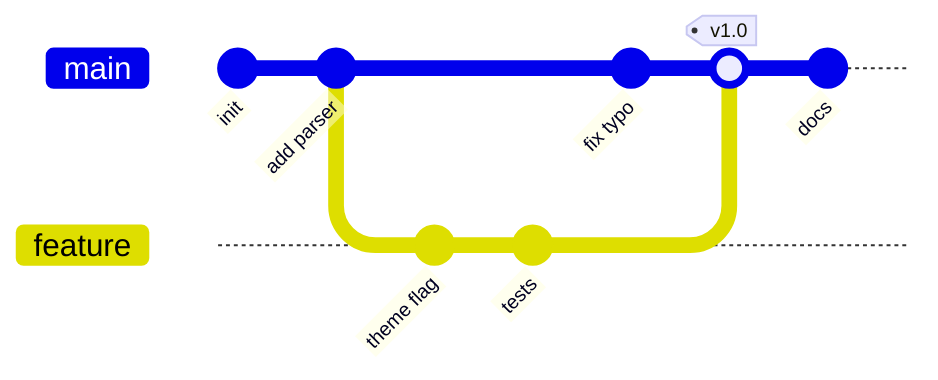
```mermaid
gitGraph
    commit id: "init"
    commit id: "add parser"
    branch feature
    checkout feature
    commit id: "theme flag"
    commit id: "tests"
    checkout main
    commit id: "fix typo"
    merge feature tag: "v1.0"
    commit id: "docs"
```

## Mindmap

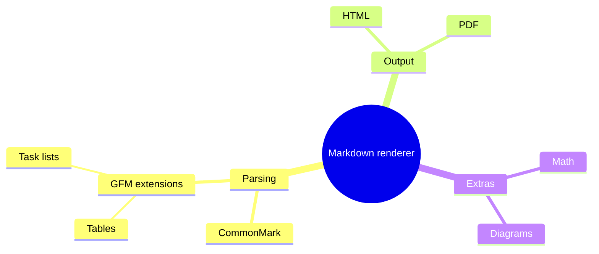
```mermaid
mindmap
  root((Markdown renderer))
    Parsing
      CommonMark
      GFM extensions
        Tables
        Task lists
    Output
      HTML
      PDF
    Extras
      Math
      Diagrams
```

## Timeline

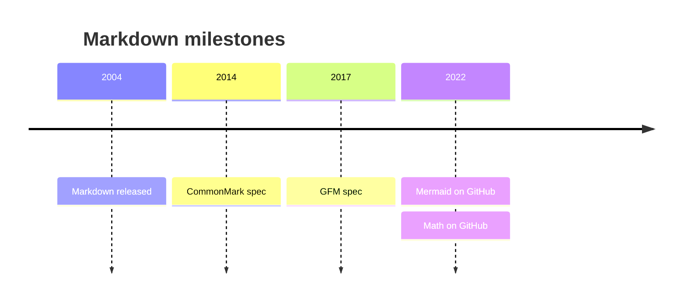
```mermaid
timeline
    title Markdown milestones
    2004 : Markdown released
    2014 : CommonMark spec
    2017 : GFM spec
    2022 : Mermaid on GitHub : Math on GitHub
```

## Quadrant chart

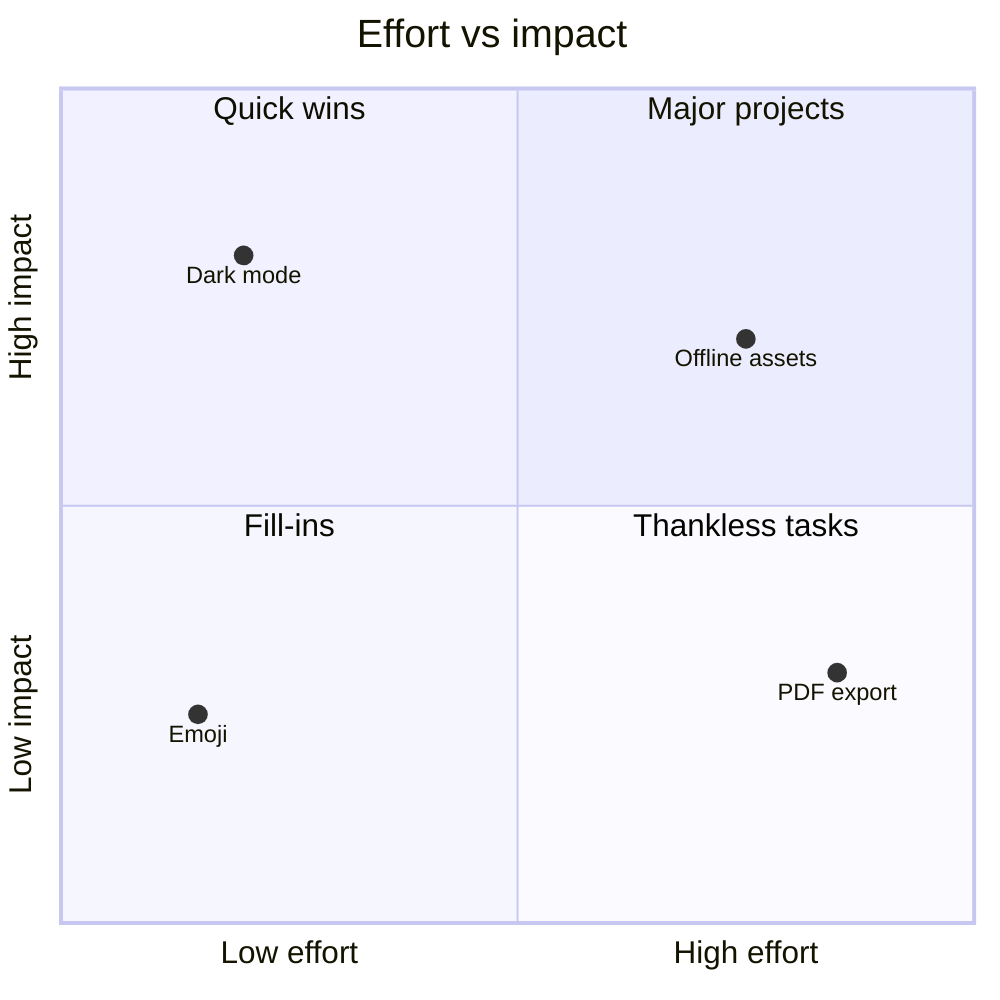
```mermaid
quadrantChart
    title Effort vs impact
    x-axis Low effort --> High effort
    y-axis Low impact --> High impact
    quadrant-1 Major projects
    quadrant-2 Quick wins
    quadrant-3 Fill-ins
    quadrant-4 Thankless tasks
    Dark mode: [0.2, 0.8]
    Offline assets: [0.75, 0.7]
    PDF export: [0.85, 0.3]
    Emoji: [0.15, 0.25]
```

## Requirement diagram

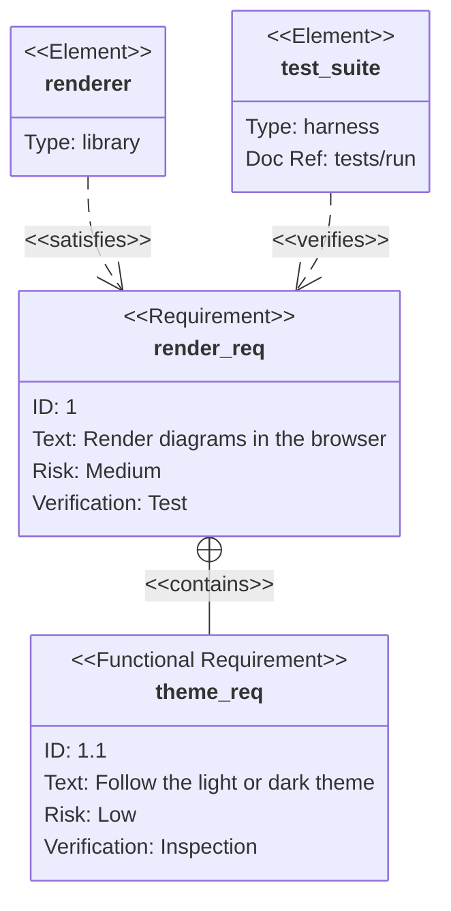
```mermaid
requirementDiagram
    requirement render_req {
        id: 1
        text: Render diagrams in the browser
        risk: medium
        verifymethod: test
    }
    functionalRequirement theme_req {
        id: 1.1
        text: Follow the light or dark theme
        risk: low
        verifymethod: inspection
    }
    element renderer {
        type: library
    }
    element test_suite {
        type: harness
        docref: tests/run
    }
    render_req - contains -> theme_req
    renderer - satisfies -> render_req
    test_suite - verifies -> render_req
```

## C4 context diagram

```mermaid
C4Context
    title System context for a markdown previewer
    Person(user, "Developer", "Reads markdown files")
    System(previewer, "Previewer", "Renders markdown to HTML")
    System_Ext(browser, "Web browser", "Shows the page")
    System_Ext(cdn, "CDN", "Serves CSS and JavaScript")
    Rel(user, previewer, "Runs")
    Rel(previewer, browser, "Opens the page in")
    Rel(browser, cdn, "Loads assets from", "HTTPS")
```

## Sankey diagram

```mermaid
sankey-beta
Visits,Docs,400
Visits,Blog,250
Visits,Pricing,150
Docs,Signup,120
Blog,Signup,40
Pricing,Signup,90
Docs,Exit,280
Blog,Exit,210
Pricing,Exit,60
```

## Block diagram

```mermaid
block-beta
    columns 3
    Frontend:3
    API Worker Cache
    space DB[("Database")] space
    API --> DB
    Worker --> DB
```

## Packet diagram

```mermaid
packet-beta
    0-15: "Source port"
    16-31: "Destination port"
    32-47: "Length"
    48-63: "Checksum"
    64-95: "Data (variable length)"
```

## Kanban board

```mermaid
kanban
    todo[To do]
        t1[Write the docs]
        t2[Add screenshots]@{ priority: 'Low' }
    doing[In progress]
        t3[Mermaid renderer switch]@{ priority: 'High' }
    done[Done]
        t4[Math support]
```

## Architecture diagram

```mermaid
architecture-beta
    group cloud(cloud)[Cloud]

    service api(server)[API] in cloud
    service db(database)[Database] in cloud
    service disk(disk)[Storage] in cloud
    service web(internet)[Internet]

    web:R --> L:api
    api:R --> L:db
    db:B --> T:disk
```

## Radar chart

```mermaid
radar-beta
    title Team skills
    axis fe["Frontend"], be["Backend"], ops["Ops"], design["Design"], docs["Docs"]
    curve a["Team A"]{4, 3, 2, 5, 3}
    curve b["Team B"]{2, 5, 4, 1, 3}
    max 5
```

## Treemap

```mermaid
treemap-beta
"Frontend"
    "Components": 40
    "Styles": 15
"Backend"
    "API": 30
    "Database": 25
"Tests": 20
```
