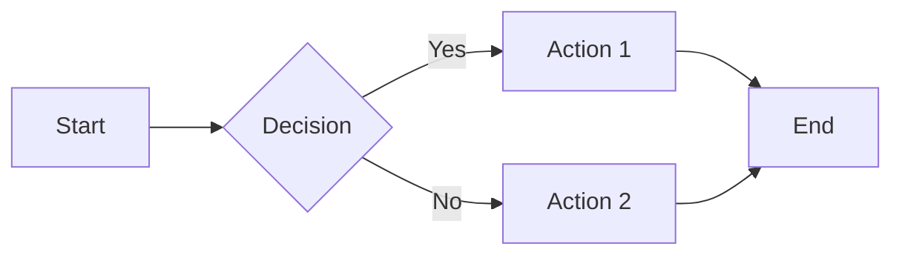

# mdread Test File

This is a test file for **mdread**, a markdown preview tool. The front matter above renders as a table.

---

## Text Formatting

Here's some **bold**, *italic*, and `inline code`. Also ~~strikethrough~~.

Combined: ***bold and italic***, **bold with `inline code`**, ~~**bold strikethrough**~~.

A [link to GitHub](https://github.com) for testing link colors.

An autolinked URL: https://github.com

An email autolink: <user@example.com>

## Headings

# Heading 1
## Heading 2
### Heading 3
#### Heading 4
##### Heading 5
###### Heading 6

## Horizontal Rules

Three styles:

---

***

___

## Paragraphs and Line Breaks

This is the first paragraph. It has multiple sentences to test text wrapping behavior across the viewport width.

This is the second paragraph, separated by a blank line.

This line has a hard break  
right here (two trailing spaces).

## Code Blocks

### Fenced with language

```python
def hello(name: str) -> str:
    return f"Hello, {name}!"

print(hello("world"))
```

```javascript
const greet = (name) => {
  console.log(`Hello, ${name}!`);
};

greet("world");
```

```rust
fn main() {
    println!("Hello, world!");
}
```

```bash
#!/bin/bash
for i in {1..5}; do
  echo "Iteration $i"
done
```

```css
.container {
  display: flex;
  gap: 1rem;
  background: var(--color-canvas-default);
}
```

```json
{
  "name": "mdread",
  "version": "1.0.0",
  "features": ["gfm", "dark-theme", "syntax-highlighting"]
}
```

```diff
- old line removed
+ new line added
  unchanged context line
```

```sql
-- Long-line SQL query to test horizontal scrolling in code blocks
SELECT u.id, u.username, u.email, u.created_at, u.last_login_at, p.display_name, p.avatar_url, p.bio, p.location, p.website_url, COUNT(DISTINCT o.id) AS total_orders, SUM(o.total_amount) AS lifetime_value, AVG(o.total_amount) AS avg_order_value, MAX(o.created_at) AS last_order_date
FROM users u
LEFT JOIN profiles p ON p.user_id = u.id
LEFT JOIN orders o ON o.user_id = u.id AND o.status NOT IN ('cancelled', 'refunded', 'pending_payment', 'flagged_for_review')
LEFT JOIN subscriptions s ON s.user_id = u.id AND s.plan_type IN ('premium', 'enterprise', 'professional') AND s.expires_at > NOW() AND s.cancelled_at IS NULL AND s.payment_status = 'active'
WHERE u.created_at BETWEEN '2024-01-01 00:00:00' AND '2024-12-31 23:59:59' AND u.is_active = TRUE AND u.email_verified = TRUE AND u.account_type != 'bot' AND (p.country_code IN ('US', 'CA', 'GB', 'DE', 'FR', 'AU', 'JP') OR p.country_code IS NULL)
GROUP BY u.id, u.username, u.email, u.created_at, u.last_login_at, p.display_name, p.avatar_url, p.bio, p.location, p.website_url
HAVING COUNT(DISTINCT o.id) > 0 AND SUM(o.total_amount) > 100.00 AND MAX(o.created_at) > NOW() - INTERVAL '6 months'
ORDER BY lifetime_value DESC, total_orders DESC, u.created_at ASC
LIMIT 500 OFFSET 0;
```

### Languages loaded on demand

```toml
# Grammar fetched only when a page uses it
name = "mdread"
themes = ["dark", "light"]
```

```dockerfile
FROM alpine:3.20
CMD ["echo", "hello"]
```

### Fenced without language

```
Plain code block with no syntax highlighting.
Should still render in a monospace font with a background.
```

### Indented code block

    This is an indented code block.
    Four spaces of indentation.
    No syntax highlighting.

## Blockquotes

> This is a blockquote to test the left border styling
> and muted text color.

> **Nested blockquotes:**
>
> > This is a nested blockquote.
> >
> > > And a third level deep.

> Blockquote with other elements:
>
> - List item inside a quote
> - Another item
>
> ```python
> print("code inside a blockquote")
> ```
>
> **Bold text** and a [link](https://example.com) inside a quote.

## Tables

### Basic table

| Feature | Status |
|---------|--------|
| GFM tables | Supported |
| Task lists | Supported |
| Code blocks | Supported |
| Dark theme | Yes |

### Alignment

| Left Aligned | Center Aligned | Right Aligned |
|:-------------|:--------------:|--------------:|
| left | center | right |
| data | data | data |
| longer content | longer content | longer content |

### Table with inline formatting

| Method | Description | Complexity |
|--------|-------------|------------|
| `sort()` | **In-place** sort | *O(n log n)* |
| `reverse()` | Reverses the list | *O(n)* |
| `index()` | Finds ~~first~~ element | *O(n)* |

### Wide table (overflow test)

| Column A | Column B | Column C | Column D | Column E | Column F | Column G | Column H |
|----------|----------|----------|----------|----------|----------|----------|----------|
| data | data | data | data | data | data | data | data |

## Lists

### Unordered

- Item 1
- Item 2
- Item 3

### Ordered

1. First item
2. Second item
3. Third item

### Starting at a specific number

5. Fifth item
6. Sixth item
7. Seventh item

### Nested list

1. First item
   - Sub-item A
   - Sub-item B
     - Deep nested
     - Another deep
   - Sub-item C
2. Second item
   1. Ordered sub-item
   2. Another ordered
3. Third item

### List with paragraphs

1. First item with a paragraph.

   This is a continuation paragraph under the first item. It should be indented and grouped with the item above.

2. Second item.

   Another continuation paragraph.

### List with no line separation

**List test**:
- item 1
- item 2

### Task list

- [x] Create mdread script
- [x] Add GitHub dark theme CSS
- [ ] Test in browser
- [ ] Ship it

### Nested task list

- [x] Phase 1
  - [x] Research
  - [x] Prototype
- [ ] Phase 2
  - [x] Implementation
  - [ ] Testing
  - [ ] Documentation

## Images


Image with title:


Theme-specific images: exactly one of these two should show.


## Links

### Inline links

[Basic link](https://github.com)

[Link with title](https://github.com "GitHub Homepage")

### Reference-style links

[Reference link][1]

[Another reference][github-home]

[1]: https://github.com
[github-home]: https://github.com "GitHub"

### Relative links

[Link to a heading](#text-formatting)

## Emphasis Edge Cases

*single asterisks*

_single underscores_

**double asterisks**

__double underscores__

***triple asterisks***

___triple underscores___

## Escaping

These characters should render literally:

\* \_ \# \+ \- \. \! \\ \` \[ \] \( \) \{ \} \|

## HTML Inline Elements

This has <sub>subscript</sub> and <sup>superscript</sup> text.

This has a <kbd>Ctrl</kbd> + <kbd>C</kbd> keyboard shortcut.

<details>
<summary>Click to expand</summary>

This content is hidden by default.

- It can contain **markdown**.
- And `code`.

```python
print("Inside a details block")
```

</details>

<details>
<summary>Another collapsible section</summary>

| Column A | Column B |
|----------|----------|
| data     | data     |

</details>

## Footnotes

Here's a sentence with a footnote[^1].

And another one[^note].

[^1]: This is the first footnote.
[^note]: This is a named footnote with more detail.

## Definition-style content (using bold + indent pattern)

**Term 1**
: Definition of term 1.

**Term 2**
: Definition of term 2.

## Alerts / Admonitions (GitHub style)

> [!NOTE]
> Useful information that users should know, even when skimming content.
> Formatting survives: **bold**, `code` and a [link](#emoji).

> [!TIP]
> Helpful advice for doing things better or more easily.

> [!IMPORTANT]
> Key information users need to know to achieve their goal.

> [!WARNING]
> Urgent info that needs immediate user attention to avoid problems.

> [!CAUTION]
> Advises about risks or negative outcomes of certain actions.

## Emoji

:+1: :rocket: :warning: :white_check_mark: :x:

GitHub shortcodes — verify these render or fall back gracefully.

Unicode emoji should always work: 👍 🚀 ⚠️ ✅ ❌

## Math (LaTeX)

Inline math: $E = mc^2$, and a set $\{a, b\}$.

Dollar amounts stay text: it costs $5 and $10.

Block math:

$$
\sum_{i=1}^{n} i = \frac{n(n+1)}{2}
$$

$$
\begin{aligned}
\nabla \cdot \mathbf{E} &= \frac{\rho}{\varepsilon_0} \\
\nabla \cdot \mathbf{B} &= 0
\end{aligned}
$$

A `math` code block, and GitHub's inline code math: $`\sqrt{2}`$

```math
\int_0^1 x^2 \, dx = \frac{1}{3}
```

## Mermaid Diagrams



## Long Content / Wrapping

This is a very long line intended to test how the renderer handles horizontal overflow or wrapping of text that extends well beyond the typical viewport width in a standard browser window on a desktop monitor with reasonable font size settings applied throughout the document.

`this_is_a_very_long_inline_code_span_to_test_overflow_handling_in_monospace_font_rendering_scenarios`

```
this_is_a_very_long_line_inside_a_code_block_to_test_horizontal_scrolling_behavior_in_the_rendered_output_of_fenced_code_blocks
```

## Special Characters

Ampersand: &amp; → &

Less than: &lt; → <

Greater than: &gt; → >

Quotes: &quot; → "

Copyright: &copy; → ©

Em dash: —

En dash: –

Ellipsis: …

## Deeply Nested Structures

> Blockquote containing:
>
> 1. An ordered list
>    - With a nested unordered item
>      - And deeper nesting
>        ```python
>        # With code inside
>        x = 42
>        ```
>      - Back to this level
>    - And here
> 2. Second ordered item
>
> | And | A Table |
> |-----|---------|
> | inside | a quote |

## Empty / Edge Cases

### Empty blockquote

>

### Empty list items

- 
- Content after empty
-

### Adjacent code blocks

```python
# Block 1
x = 1
```
```python
# Block 2
y = 2
```

### Consecutive blockquotes

> First quote.

> Second quote (should be separate).

---

*End of test file.*
