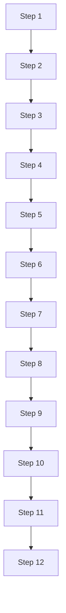

A tall, narrow diagram, for the maximum diagram height.

```mermaid
flowchart TD
  A[Step 1] --> B[Step 2]
  B --> C[Step 3]
  C --> D[Step 4]
  D --> E[Step 5]
  E --> F[Step 6]
  F --> G[Step 7]
  G --> H[Step 8]
  H --> I[Step 9]
  I --> J[Step 10]
  J --> K[Step 11]
  K --> L[Step 12]
```
